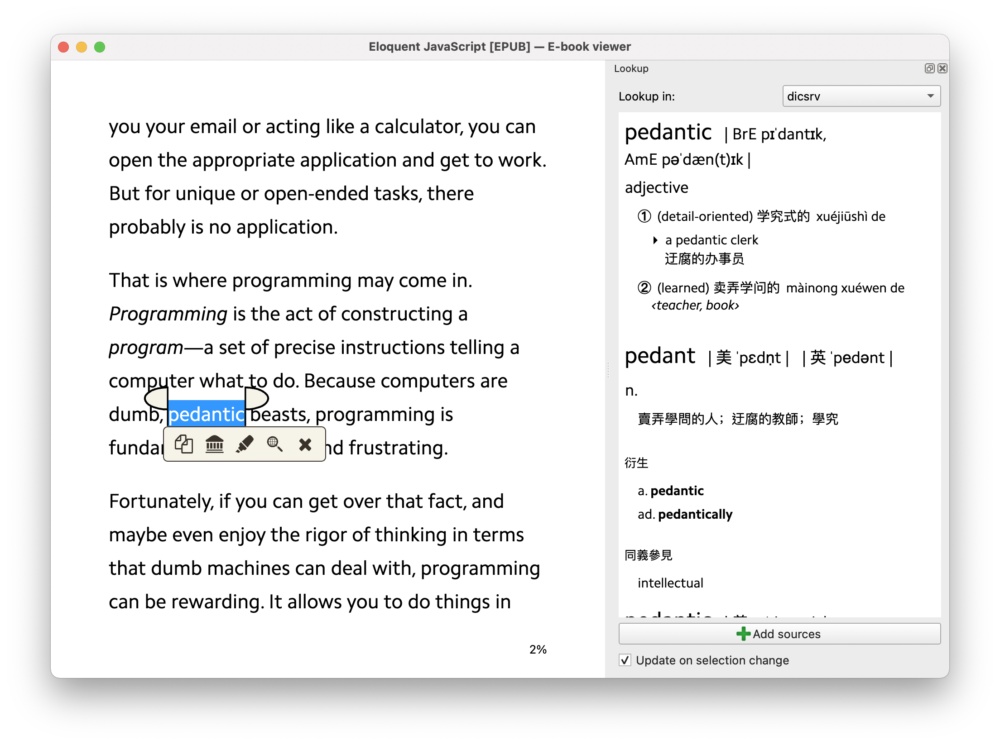

# dicsrv

HTTP service for macOS Dictionary.app.

## Run

Install [dicmd](https://github.com/cxa/dicmd), clone this repo, and

```sh
yarn start
```

## Usage

```sh
http://localhost:10101/?t=[term]&d=[dictionary name]&d=[another dictionary name]
```

Use `dicmd -l` to get dictionary names.

## Motivation

The reader provided by [Calibre](https://calibre-ebook.com) doesn't provide macOS lookup function, but provides a way to lookup via HTTP.


